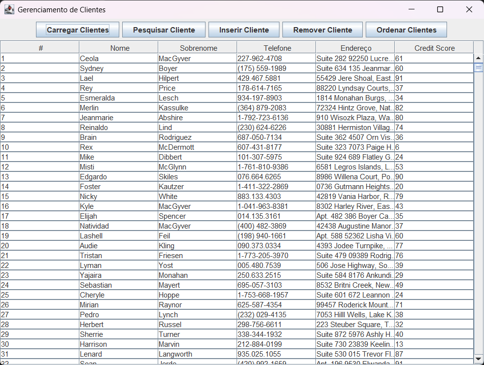
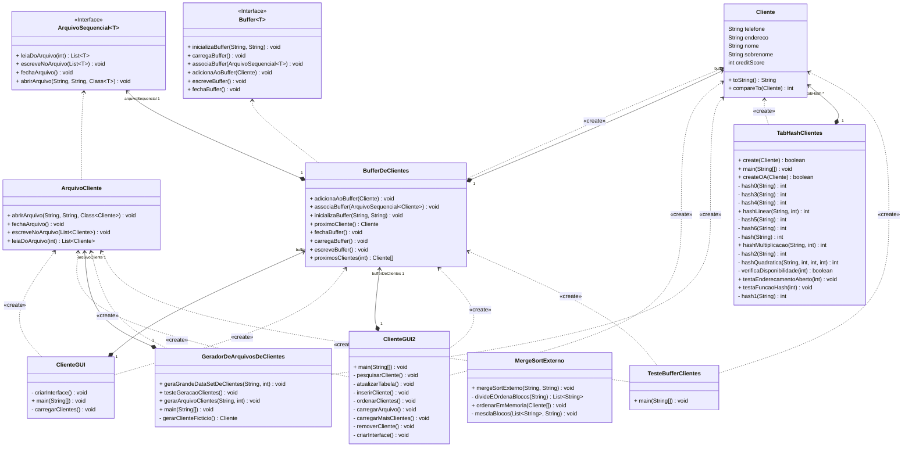

# Sistema de Gerenciamento de Cliente

## Sobre o Projeto
Desenvolvemos um sistema de gestão de cadastro de clientes para uma empresa global, com foco em manipular grandes volumes de dados. O sistema deve ser eficiente no gerenciamento de recursos, utilizando algoritmos de ordenação externa para otimizar o uso de memória ao lidar com arquivos de grande porte, além de oferecer uma interface gráfica amigável e funcional.

Com nosso programa é possível:
1. Carregar um arquivo de clientes
2. Pesquisar clientes
3. Inserir novos clientes
4. Remover clientes
5. Ordenar os clientes


### Para acessar o código, rode o comando abaixo:
```bash
git clone https://github.com/Theo-Prog10/tpa_ordena-ao_externa
```
## Tecnologias Usadas
* Java
* Maven

## Principais Bibliotecas Usadas
* Java Faker
* javax.swing

## Diagrama de Classes

